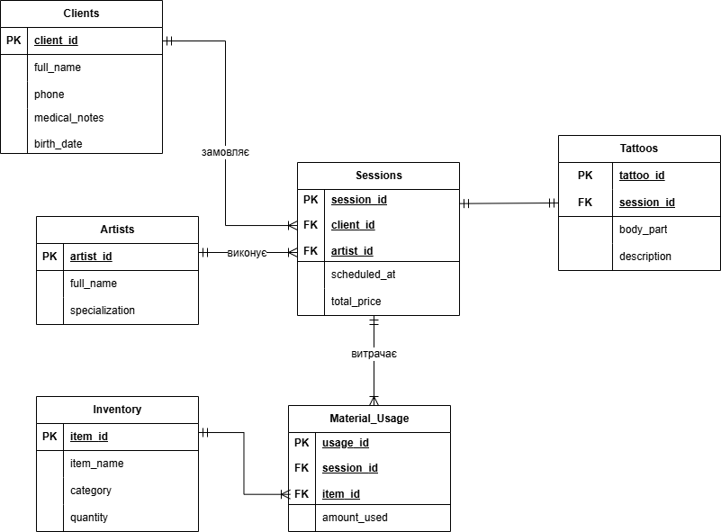

# Лабораторна робота №1

<strong>Група:</strong> ІО-44

<strong>Виконала:</strong> Чухрай А.А.

<strong>Перевірив:</strong> Русінов В. В.

## Тема: 
Збір вимог та розробка схеми ER
## Мета: 
Навчитися збирати та систематизувати вимоги до бази даних, ідентифікувати ключові сутності та їхні атрибути на прикладі обраної предметної області 'Тату-студія'. Створити концептуальну ER-діаграму (схему 'сутність-зв'язок'), яка слугуватиме логічним планом для подальшої розробки фізичної бази даних у PostgreSQL

## Короткий виклад вимог
Інформаційна система призначена для автоматизації процесів управління тату-студією, ведення обліку клієнтської бази та контролю за роботою майстрів. Система повинна забезпечувати зберігання персональних даних клієнтів (включаючи медичні застереження), керування графіком сеансів, підтримку каталогу робіт та контроль залишків розхідних матеріалів на складі.

### Потреби зацікавлених сторін:
- **Адміністратор:** Моніторинг завантаженості майстрів та залишків на складі.
- **Майстер:** Перегляд розкладу та деталей ескізу (місце на тілі, складність).
- **Клієнт:** Збереження історії татуювань та медичних особливостей (алергії).

### Основні бізнес-правила:
- Клієнт повинен бути старше 18 років.
- Один сеанс проводиться одним майстром.
- Ціна сеансу фіксується в момент запису.

---

## 2. Діаграма ER

---
## Список сутностей та їх атрибути

### Таблиця 1 - Clients (Клієнти)
| Поле | Тип | Ключ | Опис |
|------|------|------|------|
| client_id | INT | PK | Ідентифікатор клієнта |
| full_name | VARCHAR | | ПІБ клієнта |
| phone | VARCHAR | | Контактний номер телефону |
| email | VARCHAR | | Електронна пошта |
| birth_date | DATE | | Дата народження (для контролю 18+) |
| medical_notes| TEXT | | Примітки про алергії та здоров'я |

### Таблиця 2 - Artists (Майстри)
| Поле | Тип | Ключ | Опис |
|------|------|------|------|
| artist_id | INT | PK | Ідентифікатор тату-майстра |
| full_name | VARCHAR | | ПІБ майстра |
| specialization| VARCHAR | | Основний стиль (Realism, Old School тощо) |
| phone | VARCHAR | | Контактний телефон майстра |
| experience | INT | | Стаж роботи (кількість років) |

### Таблиця 3 - Sessions (Сеанси/Записи)
| Поле | Тип | Ключ | Опис |
|------|------|------|------|
| session_id | INT | PK | Ідентифікатор сеансу |
| client_id | INT | FK | Посилання на клієнта |
| artist_id | INT | FK | Посилання на майстра |
| scheduled_at | DATETIME | | Призначена дата та час сеансу |
| total_price | DECIMAL | | Підсумкова вартість послуги |
| deposit_paid | DECIMAL | | Сума внесеного завдатку |

### Таблиця 4 - Tattoos (Деталі татуювань)
| Поле | Тип | Ключ | Опис |
|------|------|------|------|
| tattoo_id | INT | PK | Ідентифікатор конкретної роботи |
| session_id | INT | FK | Посилання на сеанс |
| description | TEXT | | Опис ескізу та побажання |
| body_part | VARCHAR | | Місце нанесення на тілі |
| is_colored | BOOLEAN | | Тип роботи (кольорова чи ч/б) |

### Таблиця 5 - Inventory (Матеріали на складі)
| Поле | Тип | Ключ | Опис |
|------|------|------|------|
| item_id | INT | PK | Ідентифікатор розхідного матеріалу |
| category_id | INT | FK | Посилання на категорію товару |
| item_name | VARCHAR | | Назва (тип голки, бренд фарби тощо) |
| current_stock | INT | | Поточна кількість одиниць на складі |

### Таблиця 6 - Material_Usage (Витрати за сеанс)
| Поле | Тип | Ключ | Опис |
|------|------|------|------|
| usage_id | INT | PK | Ідентифікатор запису про списання |
| session_id | INT | FK | Посилання на сеанс |
| item_id | INT | FK | Посилання на використаний матеріал |
| quantity_used| INT | | Кількість використаних одиниць |

### Таблиця 7 - Material_Categories (Категорії розхідників)
| Поле | Тип | Ключ | Опис |
|------|------|------|------|
| category_id | INT | PK | Ідентифікатор категорії |
| category_name| VARCHAR | | Назва (Голки, Пігменти, Захист) |

### Таблиця 8 - Suppliers (Постачальники)
| Поле | Тип | Ключ | Опис |
|------|------|------|------|
| supplier_id | INT | PK | Ідентифікатор постачальника |
| company_name | VARCHAR | | Назва компанії-постачальника |
| contact_phone | VARCHAR | | Телефон для замовлень матеріалів |

### Таблиця 9 - Supply_Orders (Поставки на склад)
| Поле | Тип | Ключ | Опис |
|------|------|------|------|
| supply_id | INT | PK | Ідентифікатор закупівлі |
| supplier_id | INT | FK | Посилання на постачальника |
| supply_date | DATETIME | | Дата надходження товару |
| total_cost | DECIMAL | | Загальна сума накладної |

**PK** – первинний ключ, **FK** – зовнішній ключ.

## Зв'язки та припущення з обмеженням

* **Клієнт — Сеанс:** 1:N (кожен клієнт може мати історію з багатьох візитів).
* **Майстер — Сеанс:** 1:N (співробітник закріплюється за конкретним часом сеансу).
* **Сеанс — Деталі тату:** 1:1 (кожен сеанс відповідає одній художній роботі).
* **Сеанс — Матеріали:** M:N через таблицю `Material_Usage` (облік витрат на кожну роботу).
* **Склад — Категорії:** 1:N (кожен товар належить до певної групи для зручного пошуку).

## Припущення та обмеження:

* **Віковий контроль:** Поле `birth_date` дозволяє системі блокувати запис осіб до 18 років.
* **Історія цін:** Вартість сеансу `total_price` фіксується в момент запису і не змінюється при оновленні загального прайсу студії.
* **Безпека:** Наявність поля `medical_notes` є обов'язковою для допуску до сеансу.
* **Складський облік:** Система веде автоматичне списання залишків на основі даних таблиці `Material_Usage`.
